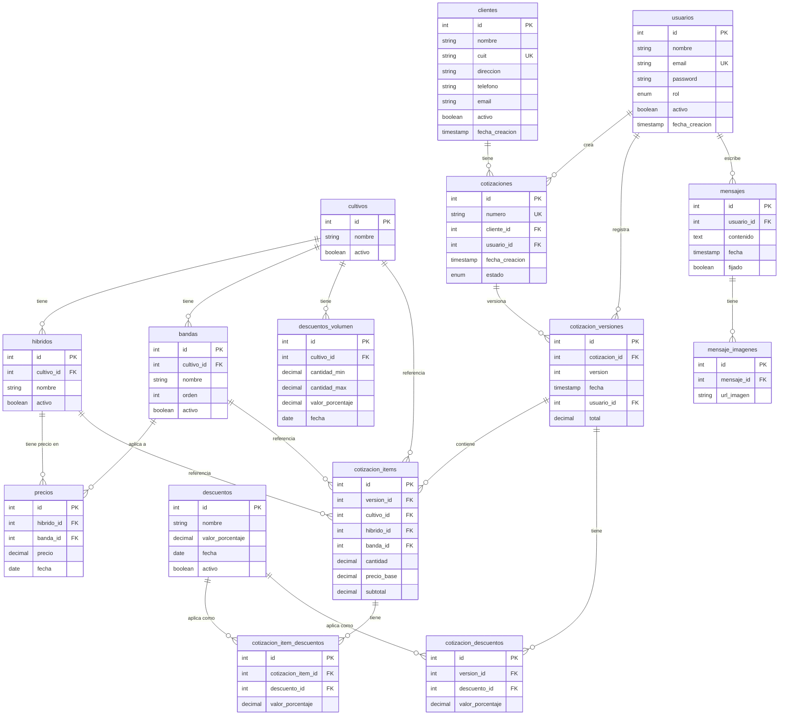

# Diagrama Entidad-Relación — Cotizador Tekros

## DER Completo (Mermaid)



---

## Convenciones de Diseño

| Patrón | Tablas afectadas | Motivo |
|--------|-----------------|--------|
| **Solo INSERT, nunca UPDATE** | `precios`, `descuentos`, `cotizacion_versiones` | Conserva historial completo |
| **Precio congelado** | `cotizacion_items.precio_base` | El precio no cambia aunque el catálogo se actualice |
| **Descuento congelado** | `cotizacion_item_descuentos.valor_porcentaje`, `cotizacion_descuentos.valor_porcentaje` | El descuento queda fijo al momento de cotizar |
| **Precio vigente** | `precios` | Usar `MAX(fecha)` agrupado por `(hibrido_id, banda_id)` |
| **Versión más reciente** | `cotizacion_versiones` | Usar `MAX(version)` agrupado por `cotizacion_id` |

---

## Índices Recomendados

| Tabla | Columnas indexadas | Tipo | Consulta que optimiza |
|-------|-------------------|------|-----------------------|
| `precios` | `(hibrido_id, banda_id, fecha DESC)` | BTREE | Precio vigente |
| `descuentos` | `(nombre, fecha DESC)` | BTREE | Historial de descuento |
| `descuentos_volumen` | `(cultivo_id, fecha DESC)` | BTREE | Descuentos vigentes por cultivo |
| `cotizaciones` | `(cliente_id)`, `(usuario_id)`, `(estado)` | BTREE | Filtros de listado |
| `cotizacion_versiones` | `(cotizacion_id, version DESC)` | BTREE | Versión más reciente |
| `cotizacion_items` | `(version_id)` | BTREE | Items de una versión |

---

## Estados de Cotización

```
borrador → enviada → aprobada → cerrada
                  ↘ rechazada
```

- **borrador**: en edición, permite crear nuevas versiones
- **enviada**: presentada al cliente, en espera de respuesta
- **aprobada**: aceptada por el cliente
- **rechazada**: declinada por el cliente
- **cerrada**: proceso completado

---

## Tablas: 15 en total

| Módulo | Tablas |
|--------|--------|
| Autenticación | `usuarios` |
| Clientes | `clientes` |
| Catálogo | `cultivos`, `hibridos`, `bandas` |
| Precios | `precios` |
| Descuentos | `descuentos`, `descuentos_volumen` |
| Cotizaciones | `cotizaciones`, `cotizacion_versiones`, `cotizacion_items`, `cotizacion_item_descuentos`, `cotizacion_descuentos` |
| Mensajes | `mensajes`, `mensaje_imagenes` |
